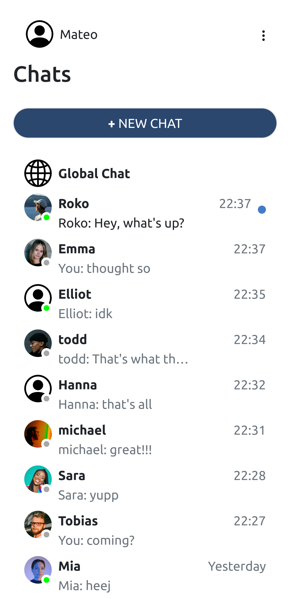
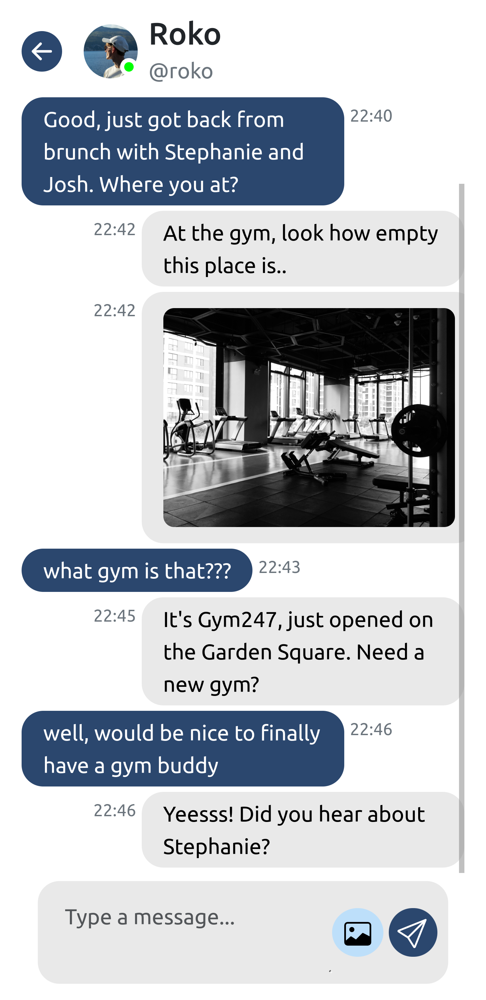

# Messaging App

A real-time messaging application that allows users to chat in the global and private chats, send images and see who's online at the moment. Built with <b>React</b> on the frontend, <b>Node.js</b> (Express) on the backend, and <b>Socket.IO</b> for real-time communication.

## Table of contents

- [Features](#features)
- [Tech Stack](#tech-stack)
- [Preview](#preview)
- [Getting Started](#getting-started)
- [Frontend Setup](#frontend-setup)
- [Backend Setup](#backend-setup)
- [Environment Variables](#environment-variables)
- [Running the Application](#running-the-application)

## Features

- Real-time messaging: Chat with other users in real time.
- User authentication: Secure login and registration system.
- Message history: View past messages within chats.
- Responsive design: Fully responsive interface for mobile and desktop users.
- Socket.IO: Real-time communication with websockets.

## Tech Stack

- Frontend: React, Vite
- Backend: Node.js, Express, Socket.IO
- Database: Prisma ORM (PostgreSQL)
- Authentication: JWT (JSON Web Token)
- Styling: CSS, Bootstrap

## Preview

<p align="center">


</p>

## Getting Started

Ensure you have the following installed:

- Node.js
- npm

Clone the repository:

```
git clone https://github.com/mateoo04/messaging-app
cd messaging-app
```

## Frontend Setup

Navigate to the client folder and install dependencies:

```
cd client
npm install
```

To build the frontend:

```
npm run build
```

## Backend Setup

Navigate to the server folder and install dependencies:

```
cd ../server
npm install
npx prisma generate
npx prisma migrate dev
```

## Environment Variables

Create a .env file in the server directory and define the necessary variables:

```
DATABASE_URL=your_database_url
SECRET=your_secret
REDIS_HOST
REDIS_PORT
REDIS_USERNAME
REDIS_PASSWORD
```

For the frontend, create a .env file in the client directory:

```
VITE_API_BASE_URL=api_url
VITE_SUPABASE_URL
VITE_SUPABASE_API_KEY
```

## Running the Application

After setting up both frontend and backend, run the following in the server directory:

```
node server.js
```

The app will be running at http://localhost:4000/ for frontend and http://localhost:4000/api for backend.
